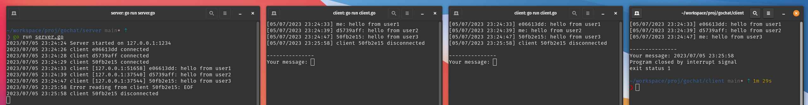

# gochat

gochat is a simple chat application written in Go. It consists of a server and client implementation that allow users to communicate over a network.

## Server

The server component (`server.go`) is responsible for accepting incoming connections and handling client communication. It listens on TCP port 1234 and supports multiple simultaneous connections. Each connected client is assigned a unique identifier and their messages are broadcasted to all other connected clients.

## Client

The client component (`client.go`) is used by individual users to connect to the server and send/receive messages. It provides a console-based interface where users can type and send messages to the server, as well as view the messages received from other clients.

## How to Use

1. Start the server by running `go run server.go` or by building and running the binary.
2. Launch the client application by running `go run client.go` or by building and running the binary.
3. Enter your message in the client console and press Enter to send it to the server.
4. Messages from other clients will be displayed in the console.

## License

This project is licensed under the [MIT License](LICENSE).

